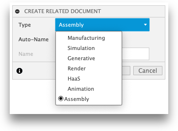

# Create Discipline Document

When working with imported AnyCAD data, in a team, or on multiple manufacturing processes, it is useful to insert an existing source document into a new related document so that work can be done in the new related document and not change or lock the source document. This add-in creates a Design Workspace command that produces a new related document from a pre-configured list of saved start document that reference the source document. The source document must be the active document and must be saved before this add-in's command can be used.

When creating the new related document you may select from a configurable list of workflows. Each workflow allows a pre-saved start document to be used to create the new related document. It also pre-populates the name of the new related document to capture workflow and the mae of the source document. This makes finding and understand why the new related document was created easier.

Here are a few example fo how you might use this add-in:

### AnyCAD

You have an existing SolidWorks document that you upload using Fusion 360 Team to you hub
you can open this SolidWorks part in Fusion 360 Desktop client and then use this asds-in to create a new referencing document for manufactuing and CNC programming.

```mermaid
graph TD

A(SolidWorks Part)
B(Manufacturing Document)

B --"X-Ref"--> A

```

Later you may need to run FEA simulation on the same SolidWorks design.

Using the add-in you can create a new related document referencing the SolidWorks AnyCAD part.

```mermaid
graph TD

A(SolidWorks Part)
B(Manufacturing Document)
C(Simulation Document)

B --"X-Ref"--> A
C --"X-Ref"--> A

```

### Render designs with a common render setup

Using the start document's ability to pre store information. You open a new empty document and activate the rendering workspace.

You can define new emissive bodies as lights and store several different options for floor. In addition you setup the render defaults for exposure, HDRI Environment map and background and camera focal settings.

```mermaid
graph TD

A(Fusion Design)
B(Render Document)

B --"X-Ref"--> A

```

## Multiple Start Documents

To best use this add-in you should pre-create and save start documents that have information already defined in them. This allows you to automate and make smart start parts that can reduce setup for your intended workflows.

You can create a specific start document for each workflow and set the default naming scheme as you configure this add-in for your specific hub, team and use cases.

```mermaid
graph LR

A(Source Part)
B{Target Document}
C1[Assembly Document]
C2[Manufacture Document]
C3[Simulation Document]
C4[Generative Document]
C5[Render Document]
C6[Animation Document]

B --"X-Ref"--> A

subgraph "Start Documents"
C1
C2
C3
C4
C5
C6
end

C1 --"Copy"--> B
C2 --"Copy"--> B
C3 --"Copy"--> B
C4 --"Copy"--> B
C5 --"Copy"--> B
C6 --"Copy"--> B

```

To select from the different start document you choose from the drop down in the dialog displayed wgen cunning the "Create Related Document" command.

Thw drop down show available start documents.

